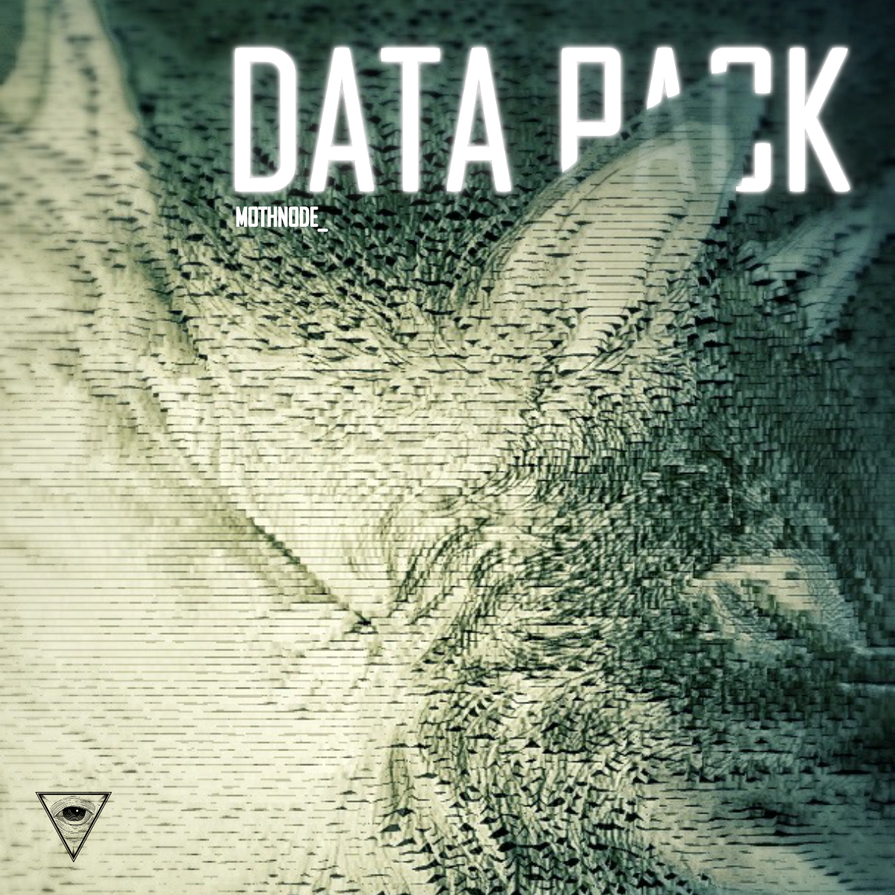

# MOTHNODE_ Data Pack

**Listen now:** 

## Project Data

Hitech Crime Cinematic Narrative Universe Single Album containing a short cinematic and a variety of transmedia content related to the lore. Photoshoot, photogrammetry vids, VR exeperience of the hunt, music video. Character profiles, wolf manifestation program profile and information, audiostory, transmissions, raw footage from encountering the target. Puzzle - who are we hunting, combine pieces together to reveal the identity of the target.

**Title:** Data Pack / **Featuring:** MOTHNODE

**Production:** Killlxv?  / **Lyrics:** MOTHNODE

**Beat:** https://www.youtube.com/watch?v=LTN2OeO_Kk8

**Narrative Design:** MOTHNODE

**Music Video Credits:** MOTHNODE

## Lyrics

```
<WIND WHISTLING THROUGH THE TREES, FOREST SOUNDS>

CHORUS
fangs out - fangs out motherfucker 
make it further into clear tracks out 
fangs out - fangs out motherfucker 
better reap what you sow
gettin far out of reach so 
ya better run from the spot

VERSE
scent is caught
motherfucker better know these eyes in the whites 
when you dive you will see the(m) bloodshot(s)   
we ain't sleepin' (we be) and circling cages 
with our predatory eyes (so fixed) direct on your folks / fixed on folks (on YOUR FLOCK)

these traps so tight 
can't escape into light
lash out pinned down
you can be sure of bite

data flows, before we make the score
set the score
 fan out fan out

data we gather, our own purpose
circling around
we be circling cages
for too long

spotlight on your folk

fangs out fangs out 
 motherfucker better - know the signs 
 fangs out fangs out  look into my eyes, 
calls me out, makes me feel allright   
 and we bleed with red and white
 
 call the wolves, call the wolves
perseverent band of fangs
 pack is angry we collectin stacks, that's right,\
 we bleed red and white
 
 you caught up, brood of fools
 make it count for the crowd
 now you gotta circle back, makes the rules,
 we ain't lettin go, take a step to us
 concrete forest is our life
 city is what makes us us
 face our wrath tonight
 
CHORUS
fangs out - fangs out motherfucker 
make it further into clear tracks out 
fangs out - fangs out motherfucker 
better reap what you sow
gettin far out of reach so 
ya better run from the spot

VERSE
scent is caught
motherfucker better know these eyes in the whites 
when you dive you will see the bloodshots   
we ain't sleepin' we be circling cages 
with our predatory eyes fixed on your folks
 
```

## Lyrics Testing Ground

16bar - verse

*italics* run in
**bold**

| x | 1 | 2 | 3 | 4 |
|---|---|---|---|---|
| 1 | *i'm in a* **fast** food | **joint** and i just  | **or**dered a  | **la**tte  |
| 2 | *the* **ca**shier | **tu**rns away  |  **con**veying what |  **i** placed |
| 3 | *i'm* **tempt**ed in a | **u**nique way  |  **you** probably |  **won't** think |
| 4 | *as i* **reach** to grab the |  **mic** i contem-  | **plate** what i | **might** say |

## Lore Notes

Need more cybermysticism for the cover of Data Pack single album. 

The lore behind the wolf motif is that operatives of Hitech Crime often use so called 'manifestations'. In the HC universe they are basically a physical real world presence of a specific digital program. 

Wolf programs are commonly used to scan and surround the prey in order to gather data and eventually contain the target. Their use will be reflected in the associated music video and a short film cinematic. Stay tuned!

## Music Video

Me with 2 virtual holograms of wolves on a virtual AR leash that dissolves once I let them out of my hand and release the programs to activate, doberman style. Slow motion low camera shot from below, moon on the sky, me in the middle and vicious scowling wolves in slowmo. Buildings, concrete jungle or forest, suburban enviros. The manifestations of the wolves are made visually of short glitchy bands that circle around the bodyshape distorting it a bit from time to time. 

Scene: wolf program operating alone in the shot.

Scene: wolf program appearing alone from the darkness in a mid distance. Walking into light then moving its head to observe the camera with its pale blue eye glow in the night.

## Short Cinematic Film

IRL manifestations, holograms, blue, Hitech Crime team on a hunt. I can see through the eyes of the wolf programs, AR glasses on eyes. Scene with the wolves just standing on both sides of me. We release the manifestations and they surveil the area of the hunt, then after analyzing the data we move in and capture targeted "entity".
